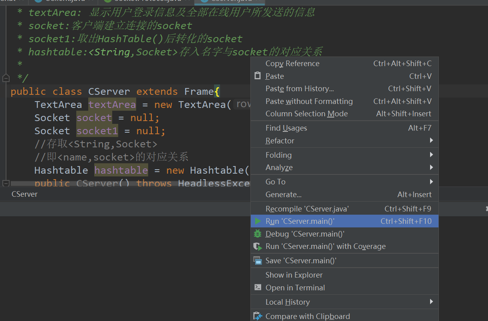
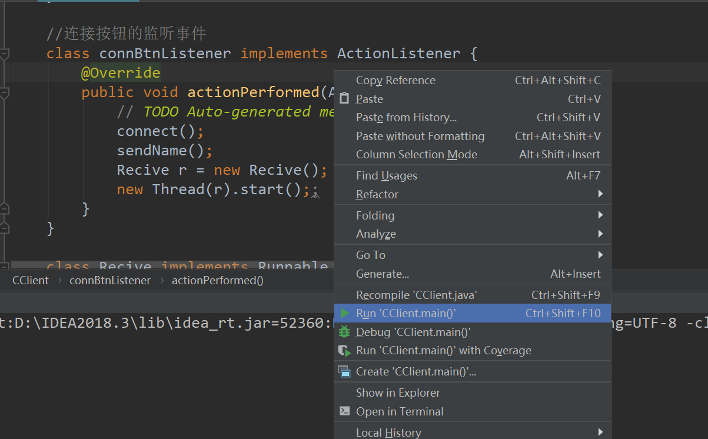
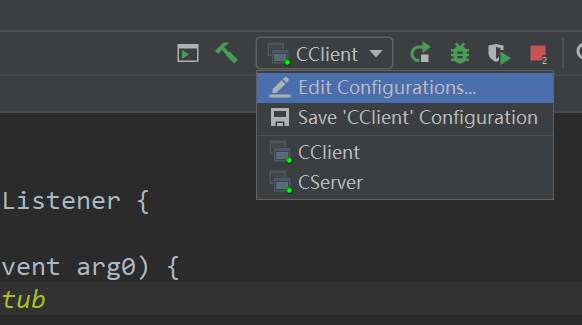
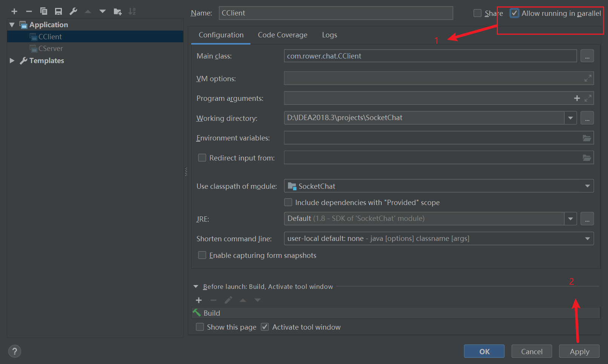
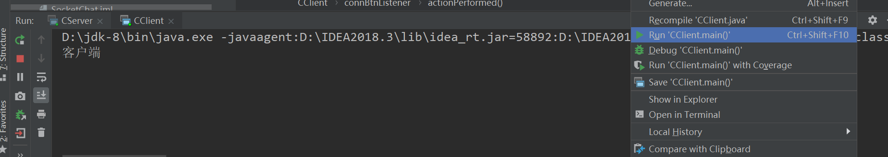
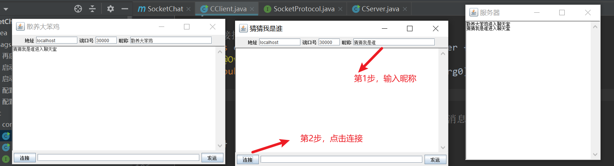
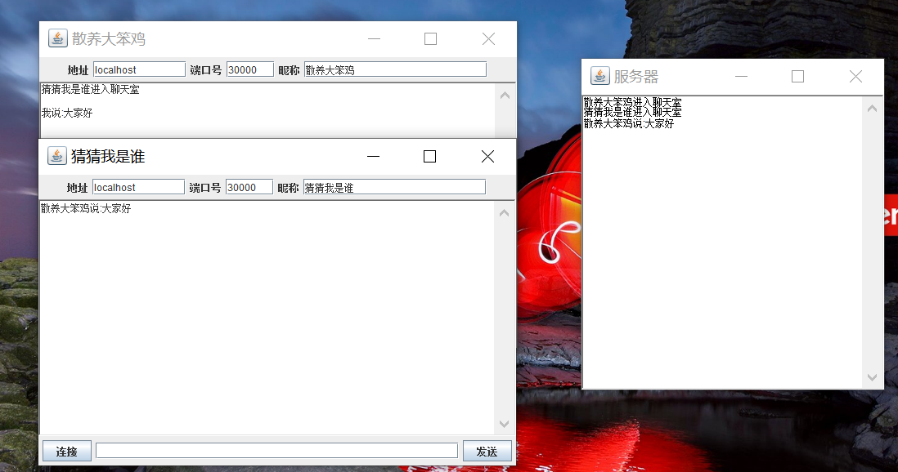
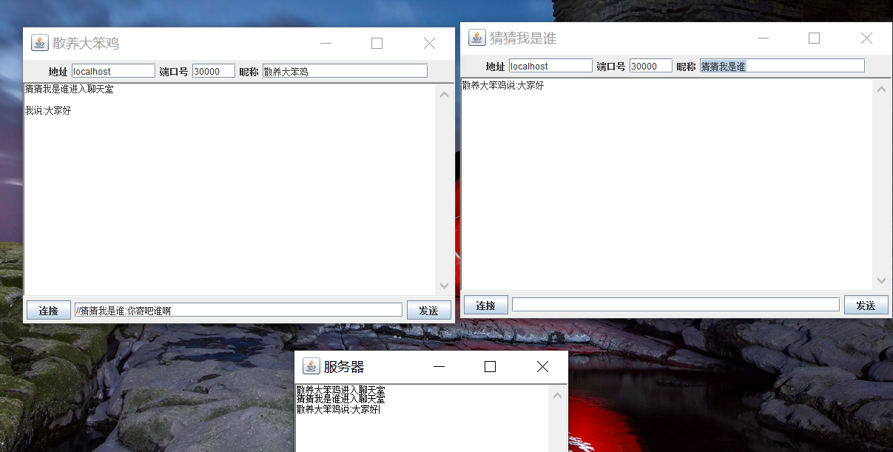
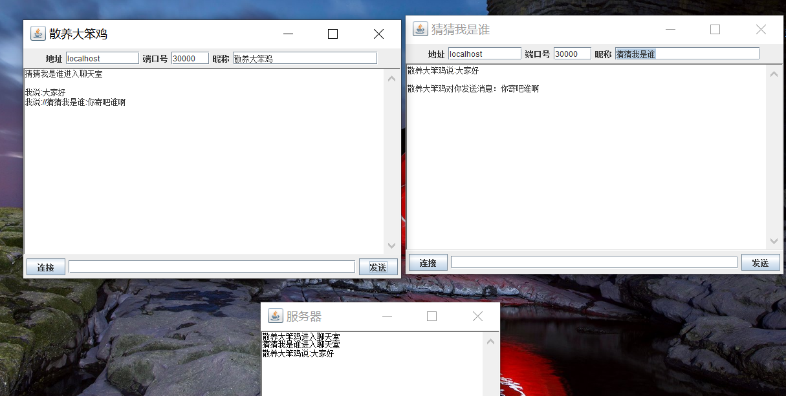

# SocketChat
基于Socket建立简单的C/S通信，实现多人聊天和私人聊天。

图像界面和聊天室部分参考一个CSDN作者，忘了名字了。

私人聊天部分参考《疯狂Java讲义》中Socket部分吧。

这个项目就是一个课程设计项目，基于C/S模式的通信

运行起来后，发现有些细节没有做好，大家可以在此基础上改正

###### 运行

1.启动

先CServer，再启动CClient。

配置并行

2.连接

输入昵称，点击连接按钮

###### 聊天

**聊天室聊天：**

在聊天框中输入内容即可聊天。

**私聊：**

私聊格式为

//+要私聊的昵称+:+说的话

例：

机器人一号对机器人二号说：lbwnb

则聊天框中输入：

//机器人二号:lbwnb

###### 关闭

点击server，x掉就行

###### 思路

代码中有一定的注释，如果能理解大概思路OK。

最近在忙，有时间的话写具体思路。其实大家一看代码就OK了。

